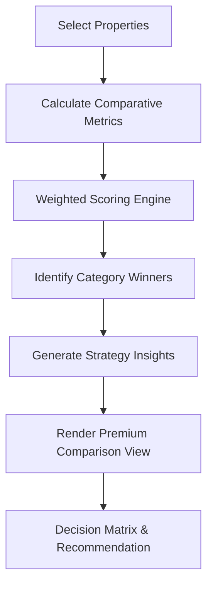

# Comparison Tooling Redesign Plan

## 1. High-Value Premium Metrics
We will focus on metrics that drive investment decisions, removing "noise" like raw input values that don't represent performance.

### Core Decision Drivers:
- **IRR (Internal Rate of Return):** The ultimate measure of long-term wealth creation.
- **Equity Multiple (MOIC):** How many euros returned per euro invested.
- **DSCR (Debt Service Coverage Ratio):** The primary risk metric for bankability.
- **Cash-on-Cash (Average):** Stabilized annual yield on cash.
- **Break-even Rent:** Safety margin against vacancy or market downturns.
- **Total Economic Benefit:** Absolute wealth created over the holding period.

## 2. Premium Design Language
- **Glassmorphism:** Use semi-transparent backgrounds with `backdrop-filter: blur()` for a modern, high-end feel.
- **Decision Matrix:** A dedicated section at the top of the comparison that explicitly recommends a "Winner" based on a balanced score.
- **Visual Hierarchy:** Use typography and color (Emerald for success, Amber for warning) to guide the eye to the most important data.
- **Comparison Cards:** Instead of a flat table, each property will have a "Card" header with its score and key tags.

## 3. Technical Implementation

### `assets/js/advisor.js`
- Enhance `compareProperties` to use a weighted scoring system:
    - IRR: 35%
    - DSCR: 25%
    - Cash-on-Cash: 20%
    - Equity Multiple: 20%
- Add "Strategy Matching": Identify if a property is a "Cash Flow King", "Wealth Builder", or "Safe Haven".

### `assets/js/app.js`
- Refactor `renderComparison` to generate a more structured, card-based layout.
- Implement the "Decision Matrix" UI.
- Add "Head-to-Head" insights (e.g., "Property A creates 15% more wealth but requires 20% more upfront capital").

### `assets/css/main.css`
- Add styles for `.comparison-card`, `.decision-matrix`, and enhanced `.comparison-table`.
- Implement smooth transitions for tab switching and hover states.

## 4. Mermaid Workflow

